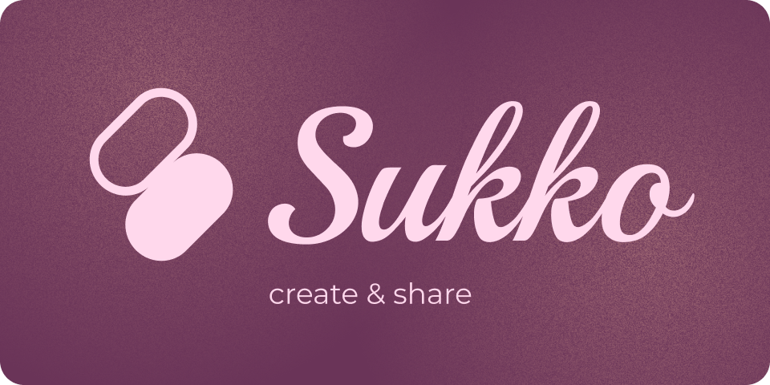
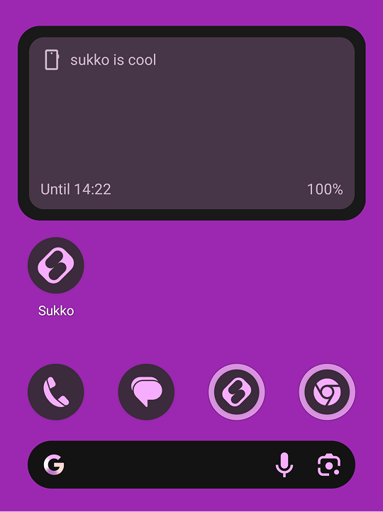

    

😈 Purple monopoly destroyer 😈

# Screenshots

    
    
    
    

# Current stage

**Experimental**

- Accessibility features are not implemented
- Expect huge changes in functionality
- Clean installation recommended. Data migration is not guaranteed
- External code contributions are welcomed, but I recommend waiting for alpha stage. There are no contributing guidelines at the moment
- Bug reports and feature requests are discouraged. I know what ku*tom is
- Not for daily usage despite implemented features and overall stability 
- Please avoid redistribution on "free and open source android app repositories" 🟢🟦

## Already implemented

List can be outdated

- Layers
  - 7 types
  - Parameters and selectors (shape, brush, color and other tools)
- Native dynamic color schemes support with all color tokens
- Responsive widgets. No need to manually use "scale" and other barbarian methods
- Modifiers (style)
  - 20 types, ORDER MATTERS
  - Unlimited combinations
- Click actions
  - 7 types of actions, including media control
  - One click can launch multiple actions
- Scripts
  - Basic syntax and documentation
  - Constants, methods, local variables, conditions and equality checks
- Global values
  - Colors, Strings, Boolean, Text styles etc
  - Concurrent evaluation. Global values are evaluated once even if used in multiple layers
- Editor
  - Compact list mode
  - Full screen parameters list mode
- Presets
  - Can be exported and imported
  - Exported data anonymization. Partially implemented
- Custom fonts
  - Exported and imported with presets
- Custom icon packs
  - Exported and imported with presets. Can be merged with existing icon packs
- Widget update strategies
  - Subscription-based system. Widgets are updated independently and only if actually needed
  - On current time change. Every minute at most. Can be slower if device is in Battery Saver mode
  - On media info change
- Tablets and foldables support

# Compatibility

- Android 12 / API 31 and higher
- vivo - no, lol
- Pixel and close to AOSP ROMs
- Anything else - visit [https://dontkillmyapp.com/](https://dontkillmyapp.com/?app=Sukko&?5) and follow instructions. If that didn't help - open an issue or buy Pixel

# Scripting

Scripting documentation is available at https://sadellie.github.io/sukko/scripting/

# Licenses

Everything here is licensed under GPL unless stated otherwise. Sukko uses [licensed code](./licence/README.md) from other projects.
