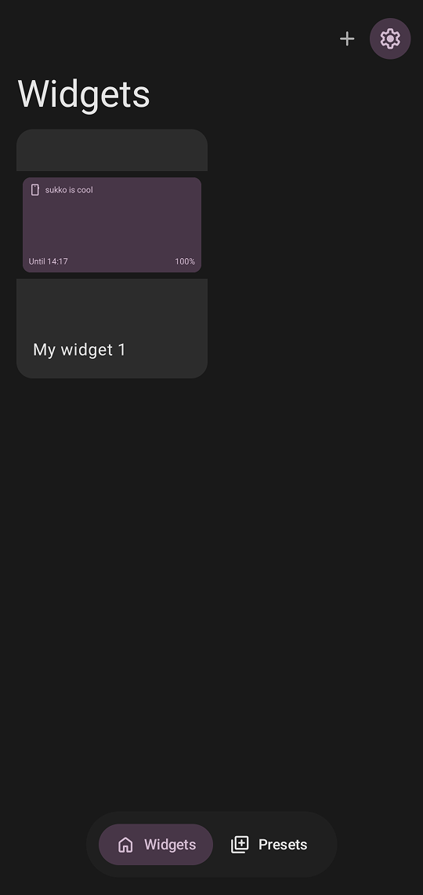
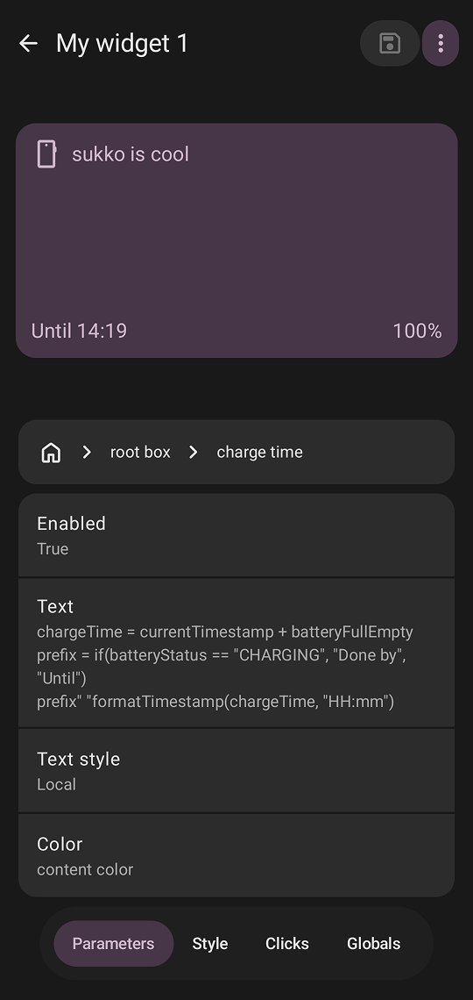
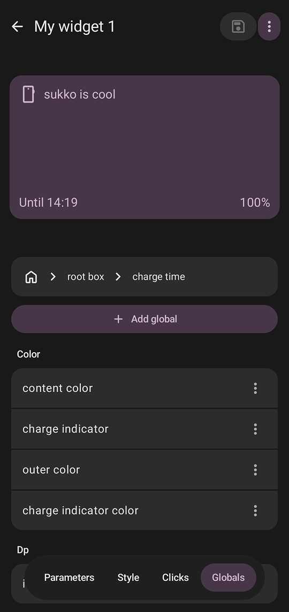

# Press kit

## What is Sukko?

Sukko is an open source Android app for creating widgets for home and lock screens.

## How to install

Latest version can be downloaded and installed from GitHub:

[https://github.com/sadellie/sukko/releases/latest](https://github.com/sadellie/sukko/releases/latest)

or you can build the app yourself.

## Current stage

Despite having most of the core features already implemented, the project is still in **Experimental stage**. Expect breaking changes until first full release.

## Developer contact

Feel free to [contact me](https://sadellie.github.io/#contact). Prefer email.

## Media

### App name

**Sukko**

- Do not change spelling
- First letter should always be capitalized 

### Logo

Do not modify colors or symbols.

    

### Screenshots

Can be slightly outdated, but they represent core functionality and main screens.

    
    
    
    

